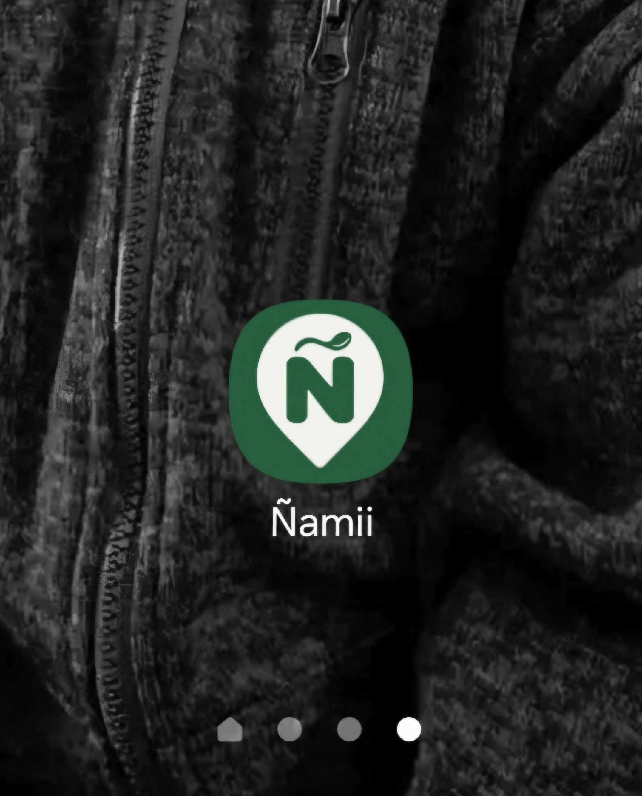
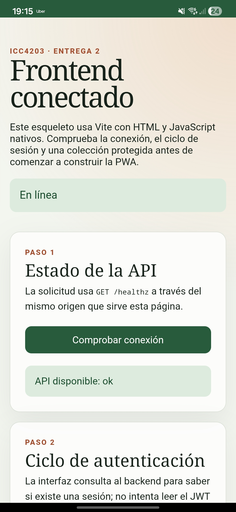
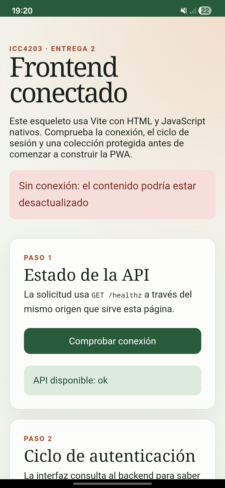
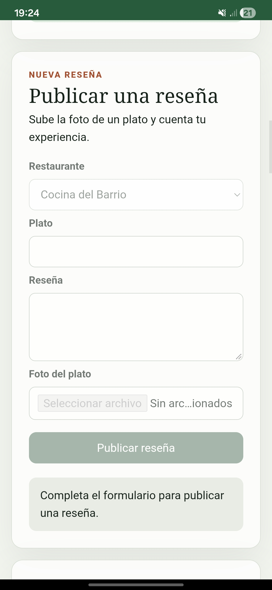
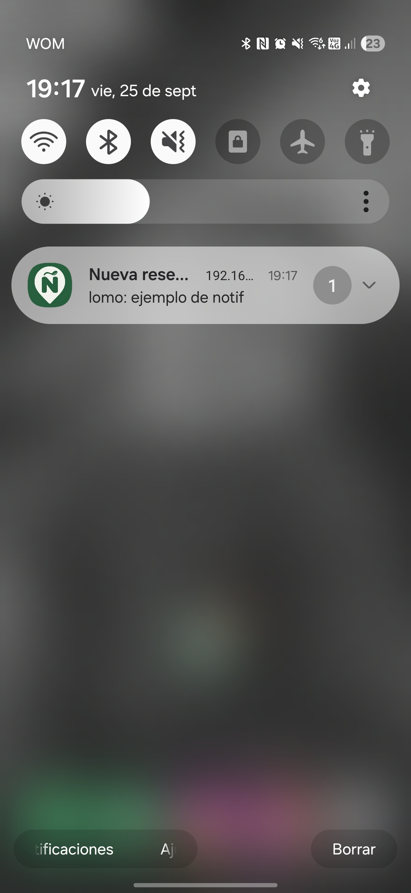

# Ñamii — Entrega 2

(Nota: Se crea rama master para dejar un pull request para el ayudante corrector)

## Integrantes del grupo

- Antonia Grandon
- Sofía Jara

## Plataforma, dispositivo y navegador evaluados

**Plataforma elegida: Android.**

| Dato | Entorno utilizado |
| --- | --- |
| Marca y modelo | Samsung Galaxy A54 5G |
| Versión de Android | Android 16 |
| Navegador usado para instalar | Google Chrome |
| Procedimiento de instalación | Menú ⋮ de Chrome → "Instalar aplicación", con la PWA servida vía HTTPS local (certificado `mkcert`) |

## Instrucciones de configuración y despliegue

### 1. Preparar variables de entorno

```console
cp .env.local.example .env.local
```

Completa en `.env.local`:

- Las variables de HTTPS local (`LOCAL_TLS`, `COOKIE_SECURE`, puertos) ya vienen con valores por defecto.
-  Se debe generar un par de claves VAPID propias (no se comparten entre grupos) con los siguientes comandos en el terminal:
  ```console
  cd backend
  uvx --from py-vapid vapid --gen
  uvx --from py-vapid vapid --applicationServerKey
  ```
  Se debe mover `private_key.pem` y `public_key.pem` a `backend/secrets/`, y copiar la clave pública impresa como `VAPID_PUBLIC_KEY` en `.env.local`.

### 2. Certificado HTTPS local

Debes obtener tu IP LAN (la de la red Wi-Fi a la que también estará conectado el celular):

```powershell
Get-NetIPAddress -AddressFamily IPv4 | Where-Object { $_.IPAddress -notlike "127.*" -and $_.IPAddress -notlike "169.254.*" } | Select-Object InterfaceAlias, IPAddress
```

¡OJO! se debe usar la IP que corresponde al adaptador Wi-Fi activo (verifica cuál con `netsh wlan show interfaces` si tienes más de uno). Luego se genera el certificado con esa IP:

```powershell
choco install mkcert
mkcert -install
.\scripts\create-local-certificate.ps1 <tu-ip-lan>
```

Si se desea se pueden pasar varias IPs a la vez (por ejemplo si trabajas desde redes distintas) separadas por espacio: `.\scripts\create-local-certificate.ps1 <ip-1> <ip-2>`. Si cambias de red y tu IP ya no está cubierta por el certificado, vuelve a correr el script con la IP nueva y reinicia el gateway con el comando `docker compose --env-file .env.local restart gateway`.

### 3. Levantar el stack

Antes de este paso se requiere **Docker Desktop abierto y corriendo** (el comando falla si el daemon de Docker no está activo).

```console
docker compose --env-file .env.local up --build
```

Se abre `https://localhost:5173` en el computador, o `https://<tu-ip-lan>:5173` desde el celular (conectado a la misma red Wi-Fi, con la CA local de `mkcert` instalada en el dispositivo).

### 4. Instalar la PWA

En Chrome Android: menú ⋮ → **"Instalar aplicación"**. Se abre en modo standalone, sin la barra de direcciones del navegador.

### Extra: Generar los íconos si no existen

```console
pip install pillow
python scripts/generate_icons.py
```

## Especificaciones de arquitectura y estrategias

### Cache Storage (app shell)

El service worker (`frontend/public/service-worker.js`) no precachea una lista fija de archivos de build. Lo que hace es:

- **Precarga en `install`** solo lo garantizado estable: `/`, `/manifest.webmanifest` y los íconos.
- **Cachea en tiempo real** (`fetch`) cualquier otra petición `GET` exitosa la primera vez que se pide (así el app shell completo (JS, CSS) queda disponible offline después de la primera visita con conexión, sin depender de nombres de archivo predecibles).
- Las respuestas de `/api/*` se excluyen explícitamente del cacheo del service worker (no se guardan JSON autenticados en Cache Storage).
- En `activate`, se eliminan todas las cachés de versiones anteriores (`CACHE_VERSION` se sube manualmente en cada cambio de código de la app).
- La actualización espera a que se cierren los clientes viejos antes de activarse (sin `skipWaiting`), para no mezclar recursos de 2 versiones.

### IndexedDB (`frontend/src/offlineFeed.js`)

Base `namii-offline`, un único object store `feed-snapshot`, con **una sola entrada** (clave fija `current`) que guarda: `{ userId, items, updatedAt }`.

- Se guarda cada vez que el feed carga con éxito estando autenticado.
- Al guardar siempre con la misma clave, la copia de un usuario nuevo reemplaza automáticamente la del usuario anterior (así no se mezclan datos entre cuentas).
- Se borra cuando el backend confirma que no hay una sesión vigente (incluye logout).
- Cuando no es posible contactar al backend (sin red) pero existe una copia guardada, se muestra en modo de solo lectura con un aviso de que podría estar desactualizada.

Las fotografías del feed se sirven directas desde `/api/v1/photos/{id}/content` (requieren la cookie de sesión); no se persisten como binario aparte para esta entrega.

## Ciclo de la suscripción Push

**Backend (completo):**

- `GET /api/v1/push/vapid-public-key`: entrega la clave pública VAPID al frontend (requiere sesión).
- `POST /api/v1/push/subscriptions`: registra o actualiza una suscripción (idempotente por `endpoint`). El `user_id` siempre sale de la sesión del servidor, nunca del cliente.
- `DELETE /api/v1/push/subscriptions`: elimina una suscripción del usuario autenticado.
- Al crear una reseña (`POST /api/v1/reviews`, que nos proporciono el profesor), el backend notifica solo a las suscripciones de usuarios que siguen al autor o al restaurante de la reseña (aplica la misma regla de visibilidad que usa el feed (`app/services/feed.py`)) excluyendo siempre al autor. Un fallo de envío a una suscripción no revierte la reseña ni bloquea los demás envíos. Una suscripción que el push service reporta como vencida o erronea (404/410) se elimina sola.
- Usamos la librería [`pywebpush`](https://github.com/web-push-libs/pywebpush) para la firma VAPID y el cifrado del mensaje.

**Frontend (`frontend/src/main.js`):**

- Botón "Habilitar notificaciones" visible solo con sesión activa; pide `Notification.requestPermission()` únicamente si el permiso todavía está en `default` (no repite el diálogo si ya fue concedido o rechazado).
- Al conceder el permiso, crea la suscripción con `pushManager.subscribe()` (clave VAPID pública obtenida de `GET /api/v1/push/vapid-public-key`) y la registra en el backend (`POST /api/v1/push/subscriptions`, idempotente por `endpoint`).
- Al cargar la app autenticada, consulta `pushManager.getSubscription()` para reflejar el estado real (activa / no suscrito) sin volver a pedir permiso.
- Al cerrar sesión, elimina la suscripción en el backend (`DELETE /api/v1/push/subscriptions`) y llama a `unsubscribe()` localmente; un login posterior no la reactiva sola.

**Service worker (`frontend/public/service-worker.js`):**

- Evento `push`: muestra la notificación (`showNotification`) con el título y texto que envía el backend.
- Evento `notificationclick`: cierra la notificación y, si ya existe una ventana/pestaña abierta en esa URL, la enfoca; si no, abre una nueva navegando directo a `/reviews/{id}`, que el frontend resuelve como la vista de esa reseña específica (`api.getReview`, `frontend/src/main.js`).

## Endpoints implementados por el grupo

Contratos (sin datos reales de suscripciones):

```
GET /api/v1/push/vapid-public-key
→ 200 { "public_key": "BKgc0T..." }
→ 401 si no hay sesión
→ 503 si el servidor no tiene VAPID configurado

POST /api/v1/push/subscriptions
Body: { "endpoint": "https://...", "keys": { "p256dh": "...", "auth": "..." } }
→ 204 No Content
→ 401 sin sesión / 403 origen no confiable / 503 error del servicio

DELETE /api/v1/push/subscriptions
Body: { "endpoint": "https://..." }
→ 204 No Content
→ 401 sin sesión / 403 origen no confiable / 503 error del servicio
```

## Evidencia

Adjuntamos capturas tomadas en el dispositivo declarado (Samsung Galaxy A54 5G, Android 16, Chrome) perteneciente a una de las integrantes del grupo, con la PWA instalada y sirviendo desde `https://<ip-lan>:5173`.

**Instalación — ícono en el launcher y app abierta en modo standalone** (sin barra de direcciones de Chrome):




**Ejecución offline** — con modo avión activado, la app muestra el aviso "Sin conexión: el contenido podría estar desactualizado" y el formulario de nueva reseña queda deshabilitado (no permite aparentar que se publicó sin conexión):




**Notificación recibida con la app cerrada** — acá un segundo usuario (`demo`, que sigue al autor de la reseña) crea una reseña; el usuario suscrito (`demo2`) la recibe en la bandeja de notificaciones del sistema con la PWA completamente cerrada (no en segundo plano):



Adicionalmente (más que nada por decisión propia y para mantener un flujo natural de la aplicación) se implementó que al tocar la notificación abre la vista de la reseña específica (`/reviews/{id}`), y el autor de la reseña no recibe notificación de su propia publicación.

## Resultado de pruebas

```console
cd backend
uv run pytest
```

```
85 passed, 14 skipped, 2 warnings
```

(Los `skipped` son pruebas de integración que requieren `TEST_DATABASE_URL`; ver [`backend/README.md`](../../backend/README.md#pruebas) para correrlas contra un PostgreSQL aislado.)

```console
cd frontend
npm test
```

```
23 pass, 0 fail
```

## Declaración de uso de IA generativa

Se usó Claude Code de Anthropic (del 21/09/2026 al 25/09/2026) como asistente durante el desarrollo de esta entrega, principalmente para:

- Diagnosticar errores puntuales encontrados, ya sean de código o de lógica, indicándonos como depurar y corregir.
- Una vez terminada la implementación nos guía a la hora de ejecutar una verificación manual de los 13 escenarios mínimos del enunciado en el dispositivo Android real (diagnóstico de certificados HTTPS/mkcert para redes Wi-Fi nuevas, consultas a la base de datos para confirmar el estado de las suscripciones push, lectura de logs del gateway y del backend).
- Ayuda con la implementación de la navegación a la vista de una reseña específica al tocar una notificación (ítem 12 de la verificación mínima).
- Ordenar las ideas de este README, tomando nuestras explicaciones previamente desordenadas se genera una estructura y redacción con sentido  para facilitar la labor del corrector, además de mantener la formalidad.

Todo el código generado o modificado con ayuda de la herramienta fue revisado y probado manualmente por el grupo antes de incorporarlo.

Se usó ChatGPT de OpenAI (del 24/09/2026 al 25/09/2026) como asistente en el desarrollo de este README para:
- Verificar ortografía, gramática y redacción.
- Corrección de formatos/funcionalidades de tipo markdown.
